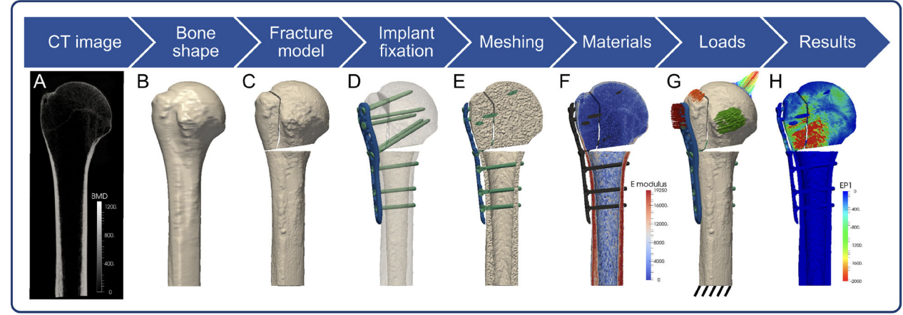

# 骨折固定的有限元分析

---

### 背景

* **骨折固定的临床需求与有限元分析 (FEA) 的意义：**
    * 骨折给社会和个人带来显著负担，包括疼痛、误工和残疾。
    * 不稳定性骨折和骨质疏松性骨折的治疗尤其具有挑战性，易导致固定失败和骨不连（骨折不愈合）。
    * 骨不连通常需要额外手术，延长患者痛苦并增加经济负担。
    * 有限元分析 (FEA) 为理解这些复杂问题提供了有力的工具。
* **稳定性概念简介：**
    * **绝对稳定：** 用于简单骨折，骨折端解剖复位后通过加压达到，骨骼可一期愈合，通常无骨痂形成。
    * **相对稳定：** 用于有间隙的骨折（例如桥接钢板、髓内钉固定），需要身体形成二期愈合组织。
  
---

### 背景(Cont. )

* **力学环境对愈合的影响：**
    * 骨折端的微小位移（骨折间隙应变）对愈合过程至关重要。
* **复杂性：**
    * 骨折固定的力学行为非常复杂，受到骨骼几何形状、骨质量、内植物设计、内植物与骨骼的相互作用、术后负荷以及患者生物学反应等多种因素的影响。 这种复杂性使得有限元分析成为研究这些现象的理想方法。

---

* **研究问题：**
    * 骨折固定有限元模型建立的一般流程。
    * 针对特定解剖区域（如股骨或肱骨近端）的建模技术。
    * 分析常见的输出结果，如内植物应力、螺钉周围骨应变或骨折端位移。

---

* **FEA 的优势：**
    * **深入洞察：** 能够详细检查模型构成和整个结构的预测结果（如应力和应变）。
    * **参数化研究：** 便于研究多个输入变量的影响，这是实验方法难以做到的。

---

---

---

* **1. 几何模型定义：**
    * **骨骼：** 使用通用骨骼模型（几何简化模型）
    * **骨折：** 通常通过虚拟截骨（切割）来模拟。一般考虑手术后初始状态，不包含愈合过程。
    * **内植物：** 可使用精确的内植物几何模型或通用模型。 螺钉常被简化（如圆柱体）。

---
* **2. 网格划分：**
    * 将三维几何体分割成许多小的单元，这些单元在节点处连接。
    * 选择合适的单元类型（如四面体）和大小，以平衡计算时间和求解精度。
* **3. 材料属性赋予：**
    * **内植物：** 通常用均质、各向同性、线弹性材料属性来模拟（如钛合金、不锈钢）。
    * **骨骼：** 材料属性更复杂。通常假定为线弹性。
        * 骨质疏松的骨骼：可通过降低弹性模量来模拟。 通常假定骨骼材料是各向同性的。
  
---

* **4. 相互作用 (接触界面)：**
    * **骨-螺钉界面：** 常模拟为完全绑定（粘合），假设在非失效情况下界面处几乎没有相对运动。
    * **钢板/髓内钉-骨骼 & 骨折块之间：** 可使用摩擦接触来模拟，允许滑动或分离，这有助于分担内植物上的载荷。
* **5. 载荷和边界条件：**
    * **载荷：** 通常分析典型日常活动（如行走）中某个峰值载荷情况下的准静态力学响应。 外部载荷主要来自关节力和肌肉力。
    * **边界条件：** 对模型施加约束以防止刚体运动（例如，固定骨骼远端的某些节点）。 边界条件对结果影响很大，需谨慎设定。
  
---
* **6. 基本输出参数：**
    * **位移：** 结构内各处的位移。骨折端的相对位移影响愈合。
    * **应变：** 由位移导出。骨折间隙应变是关键参数。骨应变常用于预测失效。
    * **应力：** 由位移导出。内植物的峰值应力关系到其屈服或疲劳失效。
    * **结构刚度：** 可计算整体结构刚度，用于与实验结果对比验证。

---

### 预期成果 / 交付物

* 一个针对所选骨折固定情景的可运行的 FEA 模型。
* 关键生物力学参数的量化结果，例如：
    * 内植物中的应力分布。
    * 螺钉周围骨骼的应变分布。
    * 骨折部位的骨折端相对位移/应变。
